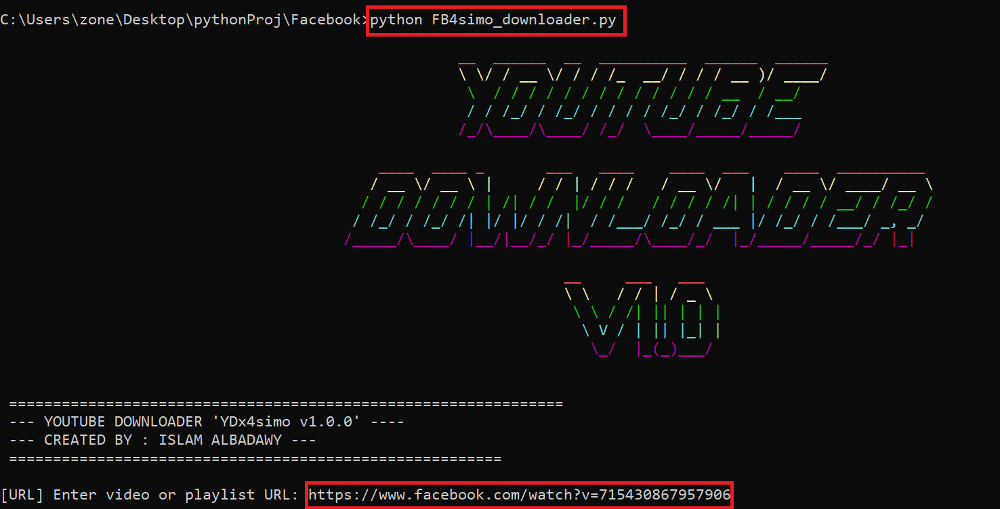
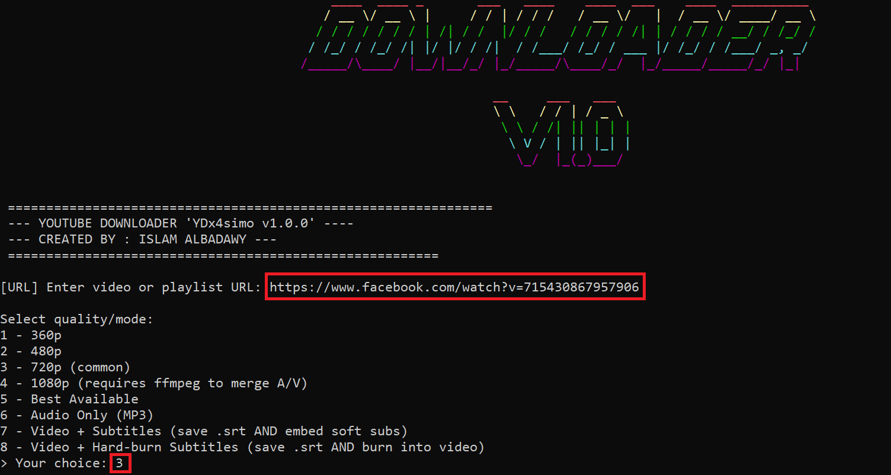
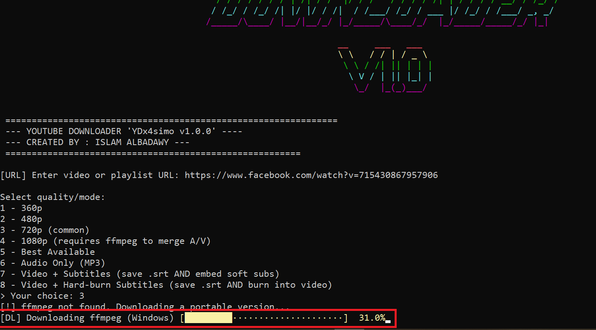
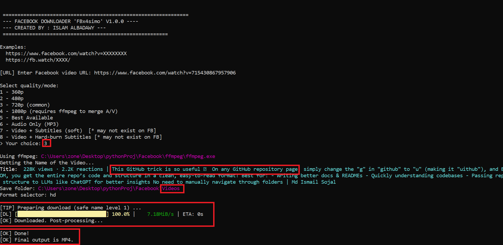
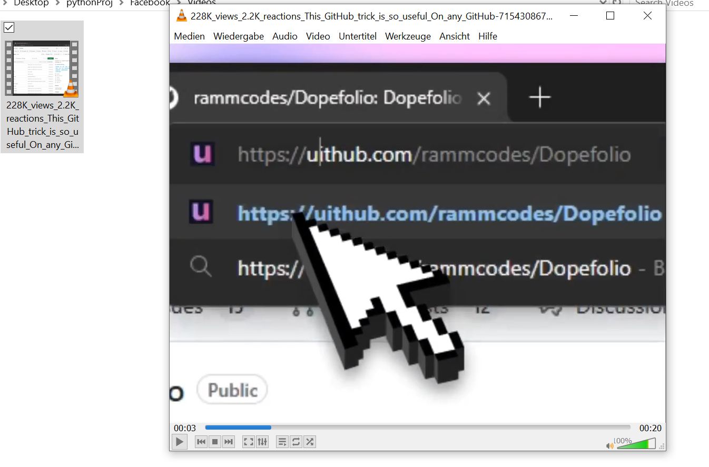

# Facebook Media Downloader CLI

A Python command-line practice project for downloading publicly available Facebook videos or reels using `yt-dlp`.

This project was created as a learning project to improve my Python skills, especially working with command-line interfaces, external libraries, dependency handling, file management and user input.
----------------------------

## Disclaimer

This project is for educational purposes only.
Please use it only with content you own, have permission to download, or that is publicly available for legal download. Always respect copyright rules and platform terms of service.

---

## Features

* Download Facebook videos and reels
* Select video quality such as 360p, 480p, 720p, 1080p or best available
* Save videos as MP4
* Extract audio as MP3
* Optional subtitle handling when available
* Automatic folder creation for downloaded files
* Colored command-line output
* Progress display during download
* Basic dependency setup using Python packages

---

## Skills Practiced

Through this project, I practiced:

* Python scripting
* Command-line application structure
* Working with external packages
* Handling user input
* File and folder management
* Error handling basics
* Using third-party tools such as `yt-dlp` and FFmpeg
* Organizing a Python project for GitHub

---

## Technologies Used

* Python
* yt-dlp
* FFmpeg
* Colorama
* PyFiglet

---

## Installation

Clone the repository:

```bash
git clone https://github.com/dx4simo/Advanced-Facebook-Downloader-FBx4simo.git
cd Advanced-Facebook-Downloader-FBx4simo
```

Install the required packages:

```bash
pip install -r requirements.txt
```

Run the application:

```bash
python FBx4simo_downloader.py
```

---

## Usage

After running the script, follow the instructions in the terminal:

```bash
python FBx4simo_downloader.py
```

The downloaded files will be saved inside the `Videos` folder.

---

## Project Structure

```text
Advanced-Videosfacebook-Downloader
│
├── FBx4simo_downloader.py
├── requirements.txt
├── README.md
├── screenshots/
│   ├── screenshot-1.png
│   ├── screenshot-2.png
│   └── screenshot-3.png
│
└── Videos/
```

---

## Screenshots

Add your screenshots inside the `screenshots` folder and update the image paths below:








---

## What I Learned

This project helped me understand how a Python script can interact with external tools and libraries.
I also learned how to structure a small command-line project, manage files, handle user choices and make the terminal output easier to read.

---

## Future Improvements

* Improve error messages
* Add a clearer menu system
* Add more input validation
* Create a simple graphical interface
* Improve project structure using separate Python modules

---

## Author

**Islam Albadawy**
Aspiring Software Developer 
